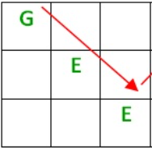

# Rail Fence Cipher

Please, read first the exercise explenation:

Basically we need to implement two functions, once for the encoding and the other for the coding.

Before continuing, note that willingly I decided to don't use buil-it functions, but to use a matrix-based approach, and basic structure, obviusly in some cases the built-in functions could have reduced code size, e.g. in some cases using join("") would have saved me some for cycles, but why not have some fun with vanilla js?

 

---

 

## Encoding explanation

Suppose you want to encode the string: _“GeeksforGeeks”_

First lets create a matrix with rows number equal to fences number, and columns numbers equals to string length

Then start filling the sub-matrix diagonals (or extra diagonals) with che characters of the string

Finally mobing up and down the diagonals, concatenate the characters.

For clarity, an example of sub-matrix is the following:

Lastly, that every sub-matrix is a squared matrix, with dimension (numFences X numFences)

 

---

 

## Decoding explanation

For the decode, you can also use a matrix-based approach,

Create a matrix with rows number equals to fences number, and columns number equals to encode string length.

Now starting with this matrix, start filling the matrix by rows, but only fill the positions where an element of the not-coded string would have been, for example the following image shows the position where a charater of the not coded string would have been inserted.

After filling the matrix, procede reading up and down the (sub-)matrix diagonals, and that's all! You have the decode string.

 

---

 

### Copyright Disclaimer

Image credits belongs to [geekforgeeks.org](https://www.geeksforgeeks.org)
